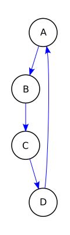

# Theorie

---

### Was ist ein Graph
* Zunächst besteht ein Graph aus einer Menge von Knoten und Kanten: G = (E,V)  (E = Knoten, V = Kanten)
* gerichtet, ungerichtet
* (a)zyklisch
* weitere Eigenschaften: gewichtet, gefärbt

---

### Gerichteter Graph

Note: Graphische Repräsentation kann auch anders sein (hier: üblich)

---

### Ungerichteter Graph

---

### Weitere Eigenschaften
* Knoten und Kanten können Eigenschaften zugewiesen werden

---

### Beispielanwendungen
* Schaltkreis: Modellierungen als azyklischer Graph
* Abhängigkeitsgraph in einer Build-Umgebung
* Stammbaum 
* Graphdatenbank 

---

### Graph als Datenstruktur - Repräsentation
* Adjazenzmatrix 
* Adjazenzliste 

